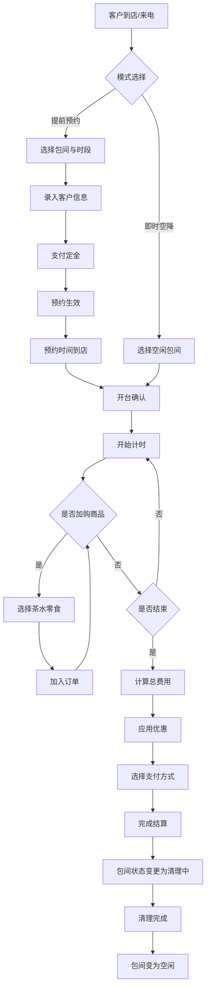

## 1. 产品概述
棋牌室和桌游吧预约管理系统，专为线下娱乐场所设计的一体化运营管理平台。
- 主要用途：包间管理、时段预约、现场开台计时结算、茶水零食加购
- 目标用户：棋牌室/桌游吧经营者、前台收银员、场地管理员
- 核心价值：提升运营效率，减少人工差错，实时掌握包间状态，优化客户体验

## 2. 核心功能

### 2.1 用户角色
| 角色 | 登录方式 | 核心权限 |
|------|----------|----------|
| 管理员 | 账号密码登录 | 全部功能：包间管理、预约管理、开台结算、商品管理、数据统计 |
| 收银员 | 账号密码登录 | 开台结算、预约管理、商品加购、查看包间状态 |

### 2.2 功能模块
1. **状态看板页**：实时显示所有包间状态（空闲/占用/预约/清理中），快速开台入口
2. **包间管理页**：包间信息CRUD，类型配置，价格设置
3. **预约管理页**：提前预约创建、查看、修改、取消
4. **开台结算页**：现场开台、计时管理、商品加购、费用结算
5. **商品管理页**：茶水零食商品信息管理，库存管理

### 2.3 页面详情
| 页面名称 | 模块名称 | 功能描述 |
|-----------|-------------|---------------------|
| 状态看板页 | 包间状态网格 | 卡片式展示所有包间，颜色区分状态，显示包间号/类型/容纳人数/当前客人/计时 |
| 状态看板页 | 快速操作栏 | 一键开台、快速预约、查看详情入口 |
| 状态看板页 | 统计概览 | 今日营收、当前占用数、空闲数、预约待开台数 |
| 包间管理页 | 包间列表 | 表格展示所有包间，支持筛选搜索 |
| 包间管理页 | 包间表单 | 新增/编辑包间：包间号、类型（麻将/扑克/狼人杀/剧本杀/PS5）、容纳人数、小时单价、时段套餐价 |
| 预约管理页 | 预约日历 | 按日期查看预约情况，时间轴展示 |
| 预约管理页 | 预约表单 | 创建预约：选择包间、日期时段、客户信息、预付定金 |
| 预约管理页 | 预约列表 | 待开/已完成/已取消预约分类查看 |
| 开台结算页 | 开台表单 | 即时空降开台：选择空闲包间、人数、开始时间 |
| 开台结算页 | 计时详情 | 已用时长、基础费用、实时金额计算 |
| 开台结算页 | 商品加购 | 选择茶水零食商品，数量调整，自动计算商品总价 |
| 开台结算页 | 结算面板 | 费用明细、优惠折扣、支付方式选择、账单生成 |
| 商品管理页 | 商品列表 | 商品分类、价格、库存展示 |
| 商品管理页 | 商品表单 | 新增/编辑商品：名称、分类、价格、库存、图片 |

## 3. 核心流程
主要业务流程包括：提前预约流程、即时空降开台流程、加购商品流程、结算结账流程。

## 4. 用户界面设计

### 4.1 设计风格
- **主色调**：深墨绿 #0F3D30（高端沉稳）
- **辅助色**：暖金色 #C9A962（奢华质感）、珊瑚橙 #FF6B4A（状态提醒）
- **中性色**：石墨灰 #1A1A1A、米白 #F5F1E8、浅灰 #E8E4DC
- **按钮风格**：圆角8px，主按钮深墨绿底金色文字，悬停微浮起效果
- **字体**：标题使用 Noto Serif SC（衬线体，高端感），正文使用 Noto Sans SC（简洁易读）
- **布局风格**：左侧导航栏 + 右侧内容区，卡片式布局，精致阴影分层
- **图标风格**：线性图标，金色描边，与整体奢华风格统一

### 4.2 页面设计概述
| 页面名称 | 模块名称 | UI元素 |
|-----------|-------------|----------|
| 状态看板页 | 包间状态网格 | 卡片圆角16px，状态色彩条顶部，脉冲动画标识占用中，渐变背景，悬停放大阴影 |
| 状态看板页 | 统计概览 | 数据卡片，金色渐变数字，迷你趋势图标，米白背景 |
| 预约管理页 | 预约日历 | 时间轴视图，彩色色块标记预约，拖拽调整时间，竖向滚动 |
| 开台结算页 | 计时详情 | 大号等宽字体计时器，每秒跳动动画，费用累加动效 |
| 开台结算页 | 结算面板 | 右侧抽屉式滑出，明细列表滚动，底部结算栏固定 |

### 4.3 响应式
- 桌面端优先设计（适配1920x1080及以上）
- 平板端自适应，侧边栏可折叠
- 包间状态网格响应式列数调整
- 关键操作按钮保持触达区域

### 4.4 动效设计
- 页面加载：元素渐入 + 轻微上浮（staggered 50ms延迟）
- 状态变更：颜色过渡动画 300ms ease-out
- 开台计时：数字跳动效果，每小时整点轻微提醒动效
- 结算抽屉：从右侧滑入 400ms cubic-bezier(0.16, 1, 0.3, 1)
- 卡片悬停：translateY(-2px) + 阴影加深
