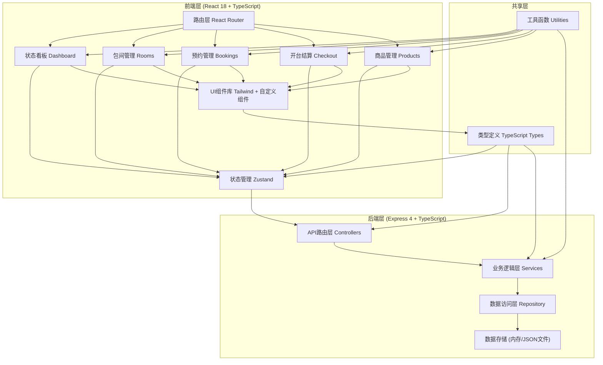
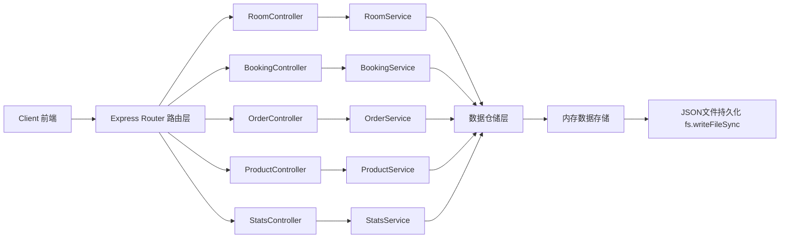
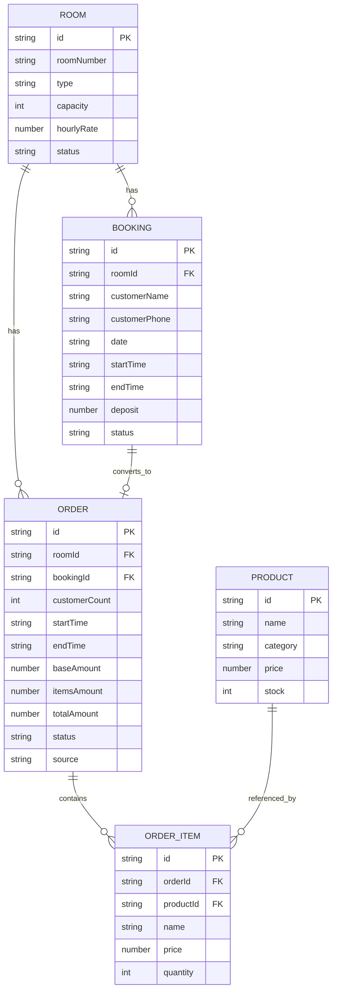

## 1. 架构设计



## 2. 技术描述
- **前端**：React@18 + TypeScript + Vite + Tailwind CSS@3 + Zustand + React Router DOM@6 + Lucide React
- **初始化工具**：vite-init (react-express-ts 模板)
- **后端**：Express@4 + TypeScript + CORS
- **数据库**：内存数据存储 + JSON文件持久化（无需外部数据库，快速部署）
- **图标库**：lucide-react

## 3. 路由定义

| 前端路由 | 页面 | 说明 |
|-----------|------|------|
| / | 状态看板 | 首页，实时包间状态总览 |
| /rooms | 包间管理 | 包间信息增删改查 |
| /bookings | 预约管理 | 预约创建、查看、管理 |
| /checkout/:orderId? | 开台结算 | 开台、计时、加购、结账 |
| /products | 商品管理 | 茶水零食商品管理 |

| 后端API路由 | 方法 | 说明 |
|-----------|------|------|
| /api/rooms | GET | 获取所有包间列表 |
| /api/rooms | POST | 新增包间 |
| /api/rooms/:id | PUT | 更新包间信息 |
| /api/rooms/:id | DELETE | 删除包间 |
| /api/bookings | GET | 获取所有预约 |
| /api/bookings | POST | 创建预约 |
| /api/bookings/:id | PUT | 更新预约 |
| /api/bookings/:id | DELETE | 取消预约 |
| /api/orders | GET | 获取所有订单/开台记录 |
| /api/orders/active | GET | 获取当前进行中的订单 |
| /api/orders | POST | 创建开台订单 |
| /api/orders/:id | PUT | 更新订单（加购商品等） |
| /api/orders/:id/checkout | POST | 结算订单 |
| /api/products | GET | 获取所有商品 |
| /api/products | POST | 新增商品 |
| /api/products/:id | PUT | 更新商品 |
| /api/products/:id | DELETE | 删除商品 |
| /api/stats | GET | 获取统计数据（今日营收等） |

## 4. API类型定义

```typescript
// 包间类型
export type RoomType = 'mahjong' | 'poker' | 'werewolf' | 'script' | 'ps5';

export interface Room {
  id: string;
  roomNumber: string;
  type: RoomType;
  capacity: number;
  hourlyRate: number;
  packageRate?: { hours: number; price: number }[];
  status: 'idle' | 'occupied' | 'reserved' | 'cleaning';
  createdAt: string;
}

// 预约类型
export interface Booking {
  id: string;
  roomId: string;
  customerName: string;
  customerPhone: string;
  date: string;
  startTime: string;
  endTime: string;
  deposit: number;
  status: 'pending' | 'confirmed' | 'completed' | 'cancelled';
  notes?: string;
  createdAt: string;
}

// 商品类型
export type ProductCategory = 'tea' | 'snack' | 'drink' | 'other';

export interface Product {
  id: string;
  name: string;
  category: ProductCategory;
  price: number;
  stock: number;
  image?: string;
  createdAt: string;
}

// 订单/开台类型
export interface OrderItem {
  productId: string;
  name: string;
  price: number;
  quantity: number;
}

export interface Order {
  id: string;
  roomId: string;
  customerName?: string;
  customerCount: number;
  startTime: string;
  endTime?: string;
  durationHours?: number;
  baseAmount: number;
  items: OrderItem[];
  itemsAmount: number;
  discount?: number;
  totalAmount: number;
  paidAmount?: number;
  paymentMethod?: 'cash' | 'wechat' | 'alipay' | 'card';
  status: 'active' | 'completed' | 'cancelled';
  source: 'walkin' | 'booking';
  bookingId?: string;
  createdAt: string;
  completedAt?: string;
}

// 统计数据
export interface Stats {
  todayRevenue: number;
  todayOrders: number;
  occupiedRooms: number;
  idleRooms: number;
  reservedRooms: number;
  cleaningRooms: number;
}
```

## 5. 后端服务架构



## 6. 数据模型

### 6.1 实体关系图



### 6.2 初始数据

```typescript
// 初始包间数据
const initialRooms = [
  { roomNumber: 'A101', type: 'mahjong', capacity: 4, hourlyRate: 48 },
  { roomNumber: 'A102', type: 'mahjong', capacity: 4, hourlyRate: 48 },
  { roomNumber: 'A103', type: 'mahjong', capacity: 6, hourlyRate: 68 },
  { roomNumber: 'B201', type: 'poker', capacity: 8, hourlyRate: 58 },
  { roomNumber: 'B202', type: 'poker', capacity: 6, hourlyRate: 48 },
  { roomNumber: 'C301', type: 'werewolf', capacity: 12, hourlyRate: 88 },
  { roomNumber: 'C302', type: 'werewolf', capacity: 15, hourlyRate: 108 },
  { roomNumber: 'D401', type: 'script', capacity: 8, hourlyRate: 128 },
  { roomNumber: 'D402', type: 'script', capacity: 10, hourlyRate: 148 },
  { roomNumber: 'E501', type: 'ps5', capacity: 4, hourlyRate: 38 },
  { roomNumber: 'E502', type: 'ps5', capacity: 2, hourlyRate: 28 },
];

// 初始商品数据
const initialProducts = [
  { name: '铁观音', category: 'tea', price: 28, stock: 100 },
  { name: '普洱茶', category: 'tea', price: 38, stock: 80 },
  { name: '菊花茶', category: 'tea', price: 18, stock: 120 },
  { name: '绿茶', category: 'tea', price: 22, stock: 100 },
  { name: '可乐', category: 'drink', price: 8, stock: 200 },
  { name: '雪碧', category: 'drink', price: 8, stock: 200 },
  { name: '矿泉水', category: 'drink', price: 5, stock: 300 },
  { name: '红牛', category: 'drink', price: 12, stock: 100 },
  { name: '薯片', category: 'snack', price: 15, stock: 80 },
  { name: '瓜子', category: 'snack', price: 12, stock: 150 },
  { name: '花生', category: 'snack', price: 10, stock: 150 },
  { name: '水果拼盘', category: 'snack', price: 58, stock: 30 },
];
```
